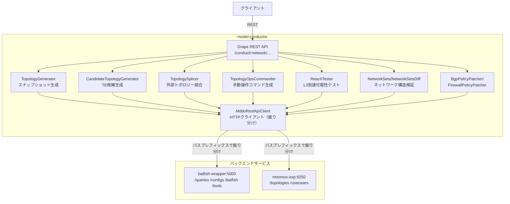

# Architecture

## システム概要

model-conductor は MDDO（Multi-Domain Demo）システムにおける**ネットワークモデル操作のフロントエンド REST API サーバー**。

「コンダクター（指揮者）」として 2 つのバックエンドサービスを呼び分けながら、RFC8345 形式のネットワークトポロジーデータの構築・変換・検証・操作をオーケストレーションする。

```
クライアント
    │ POST/GET /conduct/:network/...
    ▼
model-conductor  ←── このリポジトリ
    │
    ├── /queries, /configs, /batfish → batfish-wrapper:5000
    └── /topologies, /usecases      → netomox-exp:9292
```

## コンポーネント構成



## API エンドポイント一覧

| メソッド | パス | 機能 |
|--------|------|------|
| `DELETE` | `/conduct/:network` | ネットワーク関連リソース全削除 |
| `POST` | `/conduct/:network/:snapshot/topology` | トポロジーデータ生成（設定→RFC8345） |
| `GET` | `/conduct/:network/:snapshot/subsets` | サブセット一覧（連結成分） |
| `GET` | `/conduct/:network/:snapshot/subsets_diff` | 物理/論理スナップショット間のサブセット差分 |
| `GET/POST` | `/conduct/:network/snapshot_diff/:src/:dst` | スナップショット間トポロジー差分（POST は dst を上書き） |
| `POST` | `/conduct/:network/ns_convert/:src/:dst` | ネームスペース変換（original → emulated） |
| `POST` | `/conduct/:network/:snapshot/splice_topology` | 外部ASトポロジー結合 |
| `POST` | `/conduct/:network/:snapshot/candidate_topology` | TE候補トポロジー生成 |
| `POST` | `/conduct/:network/:snapshot/topology/:layer/policies` | BGP/FWポリシーパッチ |
| `GET` | `/conduct/:network/model_merge/:src/:dst` | モデルベース設定差分取得 |
| `GET` | `/conduct/:network/topology_ops_targets` | 現在/次のpreallocスナップショット名取得 |
| `POST` | `/conduct/:network/topology_ops` | 手動トポロジー操作コマンド生成・実行 |
| `POST` | `/conduct/:network/reachability` | L3到達可能性テスト（Batfish traceroute） |

## 主要処理フロー

### 1. トポロジーデータ生成

`POST /conduct/:network/:snapshot/topology`

```
1. batfish-wrapper: POST /configs/:nw/:ss/snapshot_patterns
   → linkdownパターン（論理スナップショット定義）を生成

2. batfish-wrapper: POST /queries/:nw/:ss  ×（物理+全論理SS）
   → ルーター設定をBatfishで解析・クエリ結果を保存

3. netomox-exp: POST /topologies/:nw/:ss/topology  ×（物理+全論理SS）
   → クエリ結果からRFC8345トポロジーを生成・保存

4. （論理SSのみ）netomox gem でdiff計算 → POST /topologies/:nw/:ss/topology
   → diff_state付きトポロジーとして上書き保存
```

### 2. L3 到達可能性テスト

`POST /conduct/:network/reachability`

```
1. test_pattern の environment/groups/patterns を展開・バリデーション
   (batfish-wrapper の networks/snapshots/interfaces API を使用)

2. 各スナップショット × 各テストケースで traceroute を実行
   batfish-wrapper: GET /batfish/:nw/:ss/:node/traceroute

3. 結果を summary（人間可読）と full_table（CSV形式）に変換して返却
```

### 3. 外部トポロジー結合

`POST /conduct/:network/:snapshot/splice_topology`

```
1. netomox-exp から現在の内部トポロジーを取得

2. TopologySplicer.splice!:
   - 外部AS のノード/リンクを内部トポロジーへ挿入
   - bgp_as layer のリンクを起点に bgp_proc/layer3 のリンクを追加

3. (optional) Layer3PreallocatedResourceSplicer.splice!:
   - 事前割り当てL3リソースを layer3 へ追加

4. overwrite=true なら netomox-exp へ保存
```

### 4. 手動トポロジー操作

`POST /conduct/:network/topology_ops`

```
1. 現在の original_asis_preallocated_N スナップショットを取得

2. コマンドに応じたOpsCommanderを選択:
   - connect_link  → LinkOpsCommander
   - shutdown_intf → ShutOpsCommander

3. 現在状態を分析し、操作後の remove_links/append_links/command_list を計算

4. dry_run=false なら:
   - next preallocated(N+1) スナップショットとして保存
   - ネームスペース変換テーブルを更新
   - N→N+1 の差分を計算して上書き
   - Netoviz インデックスを更新
```

## データモデル

### RFC8345 トポロジーデータ（中心データ）

```json
{
  "ietf-network:networks": {
    "network": [
      {
        "network-id": "layer3",
        "node": [
          {
            "node-id": "router-name",
            "mddo-topology:l3-node-attributes": { "node-type": "node" },
            "ietf-network-topology:termination-point": [
              { "tp-id": "eth0", "mddo-topology:l3-termination-point-attributes": { "ip-address": ["192.0.2.1/30"] } }
            ]
          }
        ],
        "ietf-network-topology:link": [ ... ]
      },
      { "network-id": "ospf_area0", ... },
      { "network-id": "bgp_proc", ... },
      { "network-id": "bgp_as", ... }
    ]
  }
}
```

このデータは netomox-exp に保持され、model-conductor 内では `Netomox::Topology::Networks` オブジェクトに変換して操作する。

### ネームスペース変換テーブル

```json
{
  "node_name_table": {
    "original-name": { "l3_model": "model-name", "l1_principal": "emulated-name" }
  },
  "tp_name_table": {
    "original-name": {
      "original-intf": { "l3_model": "model-intf", "l1_principal": "emulated-intf" }
    }
  }
}
```

original（設定ファイルの名前）→ emulated（エミュレーション環境の名前）の変換テーブル。`topology_ops` API はトポロジー操作時にこのテーブルも更新する。

### スナップショット命名規則

| パターン | 説明 |
|---------|------|
| `<network>` | 物理スナップショット（設定から直接生成） |
| `<network>_linkdown_NN` | 論理スナップショット（リンクダウンシミュレーション） |
| `original_asis` | 元の設定ベース |
| `emulated_asis` | ネームスペース変換後（エミュレーション環境向け） |
| `original_asis_preallocated_N` | 手動操作で段階的に生成（N は連番） |
| `original_candidate_<phase><index>` | TE 候補トポロジー |

## 設計上の前提・暗黙知

### topology_ops が生成する OVS コマンドの実行主体

`tobe_resource.command_list` に `ovs-vsctl add-port/del-port` コマンドが含まれるが、本サービス内では実行しない。別システム（おそらく playground の他サービス）がレスポンスを受け取って実行する想定。

### Netomox gem のオープンクラスパッチ

3 か所でオープンクラスを使って機能追加している。gem のアップデート時は非互換に注意:

- `lib/splice_topology/netomox_patch.rb` — ノード/ネットワークの append/replace 操作
- `lib/topology_ops/netomox_patch.rb` — `SB_NAME`（shutdown bridge）定数、リンク操作
- `lib/generate_candidate_topologies/netomox_topology.rb` — prefix_set 検索

### セグメントノードの命名規則

Layer3 トポロジーのセグメントノード名は `Seg_<IPネットワークアドレス/プレフィックス長>` 形式（例: `Seg_192.0.2.0/30`）。`NetworkSubset` のフラグ検出がこの命名パターンに依存している。

### HTTP タイムアウトは 4 時間

`MddoRestApiClient` のタイムアウトは `60 * 60 * 4` 秒。トポロジー生成が多数のスナップショットをバッチ処理するため。
